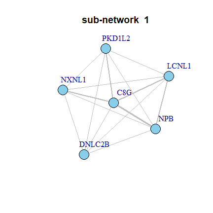

<!-- README.md is generated from README.Rmd. Please edit that file -->

# regnet

> **Reg**ularized **Net**work-Based Variable Selection

<!-- badges: start -->

[](https://travis-ci.org/jrhub/regnet)
[](https://cran.r-project.org/package=regnet)
[](http://www.r-pkg.org/pkg/regnet)
<!-- badges: end -->

Network-based regularization has achieved success in variable selection
for high-dimensional biological data due to its ability to incorporate
correlations among genomic features. This package provides procedures of
network-based variable selection for generalized linear models ([Ren et
al.(2017)](https://doi.org/10.1186/s12863-017-0495-5) and [Ren et
al.(2019)](https://doi.org/10.1002/gepi.22194)). Two recent additions
are the robust network regularization for the survival response and the
network regularization for continuous response. Functions for other
regularization methods will be included in the forthcoming upgraded
versions.

## How to install

  - To install the devel version from github, run these two lines of
    code in R

<!-- end list -->

    install.packages("devtools")
    devtools::install_github("jrhub/regnet")

  - Released versions of regnet are available on CRAN
    [(link)](https://cran.r-project.org/package=regnet), and can be
    installed within R via

<!-- end list -->

    install.packages("regnet")

## Examples

### Survival response

#### Example.1 (Robust Network)

``` 
data(SurvExample)
X = rgn.surv$X
Y = rgn.surv$Y
clv = c(1:5) # variable 1 to 5 are clinical variables, we choose not to penalize them here.
out = cv.regnet(X, Y, response="survival", penalty="network", clv=clv, robust=TRUE, verbo = TRUE)
out$lambda
b = regnet(X, Y, "survival", "network", out$lambda[1,1], out$lambda[1,2], clv=clv, robust=TRUE)  
index = which(rgn.surv$beta[-(1:6)] != 0)  # [-(1:6)] removes the intercept and clinical variables that are not subject to selection.
pos = which(b[-(1:6)] != 0)  
tp = length(intersect(index, pos))  
fp = length(pos) - tp  
list(tp=tp, fp=fp)  
```

##### The cross-validation step can run on multiple cores (OpenMP):

    # detect the number of CPU cores on the current host
    library("parallel")
    ncores = parallel::detectCores(logical=FALSE) # ncores>2 can show significant increases in speed
    # parallel CV 
    out = cv.regnet(X, Y, response="s", penalty="n", clv=clv, robust=TRUE, ncores=ncores, verbo = TRUE)

### Binary response

#### Example.2 (Network Logistic)

``` 
data(LogisticExample)
X = rgn.logi$X
Y = rgn.logi$Y
out = cv.regnet(X, Y, response="binary", penalty="network", folds=5, r = 4.5)  
out$lambda 
b = regnet(X, Y, "binary", "network", out$lambda[1,1], out$lambda[1,2], r = 4.5)
index = which(rgn.logi$beta[-1] != 0)   # [-1] removes the intercept
pos = which(b[-1] != 0)  
tp = length(intersect(index, pos))  
fp = length(pos) - tp  
list(tp=tp, fp=fp)  
```

### Continuous response

#### Example.3 (Network graphs)

    data(ContExample)
    X = rgn.tcga$X
    Y = rgn.tcga$Y
    clv = (1:2)
    fit = regnet(X, Y, "continuous", "network", rgn.tcga$lamb1, rgn.tcga$lamb2, clv =clv, alpha.i=0.5)
    net = plot(fit)
    subs = plot(fit, subnetworks = TRUE, vsize=20, labelDist = 3, theta = 5) 

<!-- -->
<!-- -->

## News

### regnet (development version) \[2020-5\]

  - cv.regnet() now can run on multiple cores via the support of OpenMP
    library.
  - A generic function plot() is added for plotting the network
    structures among the identified genetic variants.

### regnet 0.4.0 \[2019-6-7\]

Based on users’ feedback, we have

  - Added more checking steps for data format, which help users make
    sure their data are in the correct format.
  - Provided more information in the documentation for troubleshooting.

### regnet 0.3.0 \[2018-5-21\]

  - Two new, easy to use, integrated interfaces: cv.regnet() and
    regnet().
  - New methods for continuous and survival responses.
  - The new “clv” argument allows the presence of clinical variables
    that are not subject to penalty in the X matrix.

### regnet 0.2.0 \[2017-10-14\]

  - Provides c++ implementation for coordinate descent algorithms. This
    update significantly increases the speed of cross-validation
    functions in this package.

## Methods

This package provides implementation for methods proposed in

  - Ren, J., He, T., Li, Y., Liu, S., Du, Y., Jiang, Y., Wu, C. (2017).
    Network-based regularization for high dimensional SNP data in the
    case-control study of Type 2 diabetes. [BMC
    Genetics, 18(1):44](https://doi.org/10.1186/s12863-017-0495-5)

  - Ren, J., Du, Y., Li, S., Ma, S., Jiang,Y. and Wu, C. (2019). Robust
    network-based regularization and variable selection for high
    dimensional genomics data in cancer prognosis. [Genet.
    Epidemiol. 43:276-291](https://doi.org/10.1002/gepi.22194)

## References

  - Wu, C., and Ma, S. (2015). A selective review of robust variable
    selection with applications in bioinformatics. [Briefings in
    Bioinformatics, 16(5), 873–883](http://doi.org/10.1093/bib/bbu046)

  - Wu, C., Shi, X., Cui, Y. and Ma, S. (2015). A penalized robust
    semiparametric approach for gene-environment interactions.
    [Statistics in Medicine, 34
    (30): 4016–4030](https://doi.org/10.1002/sim.6609)

  - Wu, C, Jiang, Y, Ren, J, Cui, Y, Ma, S. (2018). Dissecting
    gene-environment interactions: A penalized robust approach
    accounting for hierarchical structures.[Statistics in
    Medicine, 37:437–456](https://doi.org/10.1002/sim.7518)
